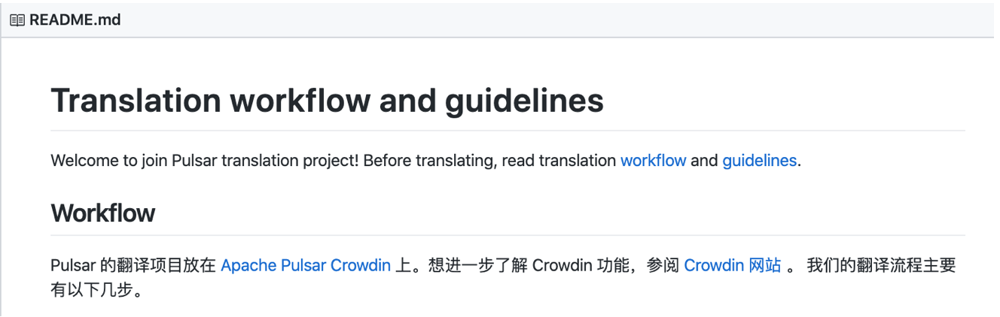
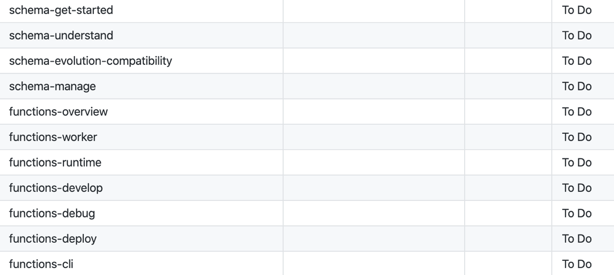
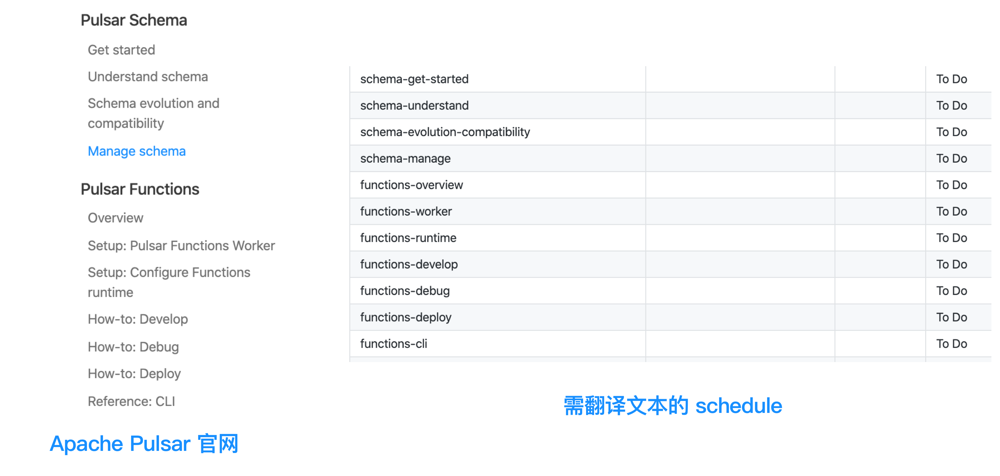
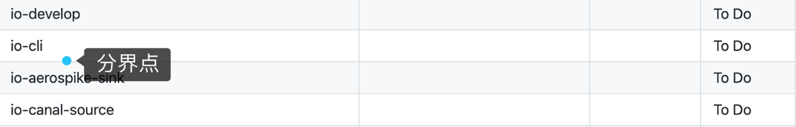
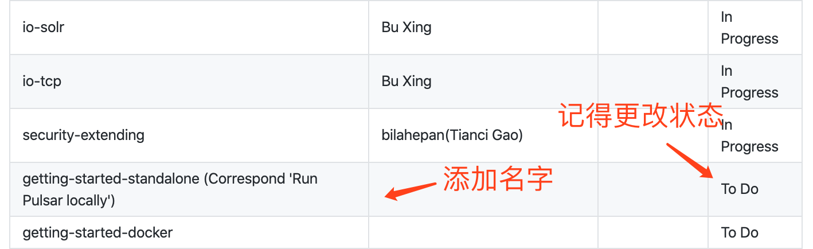
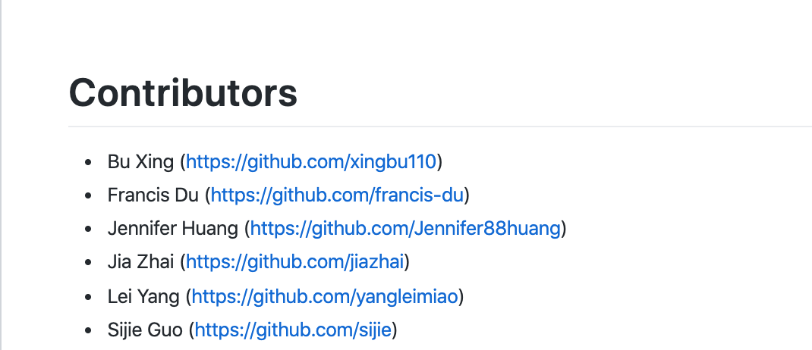

# 翻译前必读（中文）

此篇文章主要给大家更清晰的描述一下翻译的过程、选择文章片段等问题。
希望可以让你更轻松愉快的进行文档翻译。

## 📖翻译流程+用词规范

具体操作参考🔗：[https://github.com/apache/pulsar-translation](https://github.com/apache/pulsar-translation)

会有详细的步骤告诉你「如何申请账号」「如何认领文章」等等。

##  🔍选择文章（篇幅/范围）
直接进入 Crowdin 网站时，会显示全部的文档（让你有点不知所措），光看名字可能并不知道要翻译的大概内容。

那么此时你需要参考两个链接。

**1.需要翻译的文档题目：**[https://github.com/apache/pulsar-translation/blob/master/schedule.md](https://github.com/apache/pulsar-translation/blob/master/schedule.md)

**2.Apache Pulsar 官网的文档内容**：[http://pulsar.apache.org/docs/en/next/schema-manage/](http://pulsar.apache.org/docs/en/next/schema-manage/)

【链接1】为该阶段我们需要翻译的文档题目，你只需要挑选后半部分、状态为「 To Do 」的文档即可，然后去 Crowdin 进行翻译。

同时，如果你不清楚挑选的文档篇幅长短，那么你可以参考【链接2】的官网文档。【链接1】里的 「To Do」状态的文章排序，均按照左边导航栏的题目顺序一一对应的。

PS: 与官网顺序同步的文档，截止到 io-cli，也就是如下图所示。cli 以后的文档内容，均为之前文章里插入的链接文档，可以自行选择翻译。

## 🎉成为 Contributor/ Committer
当你开始翻译后，记得去 [schedule](https://github.com/apache/pulsar-translation/blob/master/schedule.md) 修改文档所属人员名称（你的 GitHub 账户名称）和文章状态，并提交修改「Schedule」的 PR 。

之后可以在 [CONTRIBUTORS](https://github.com/apache/pulsar-translation/blob/master/CONTRIBUTORS.md) 中加上自己的名字。

您贡献得越多，收获就会越多，我们衷心希望您能快快加入 Pulsar contributors club。

##  🎁周边礼物
如果你翻译的数量和质量达标，我们会主动和您联系，为您发放有关 Apache Pulsar 的相关周边。比如卫衣、书包、T恤等等，都有可能哦。

---
我们希望大家在贡献的同时，有所收获，快乐成长。在必要的时候，可以用您参与的「Apache Pulsar 的项目」来展示和证明自己的才华。

期待你成为 Apache Pulsar 的 Contributor，让我们一起为 Apache Pulsar 开源社区贡献吧！ 
