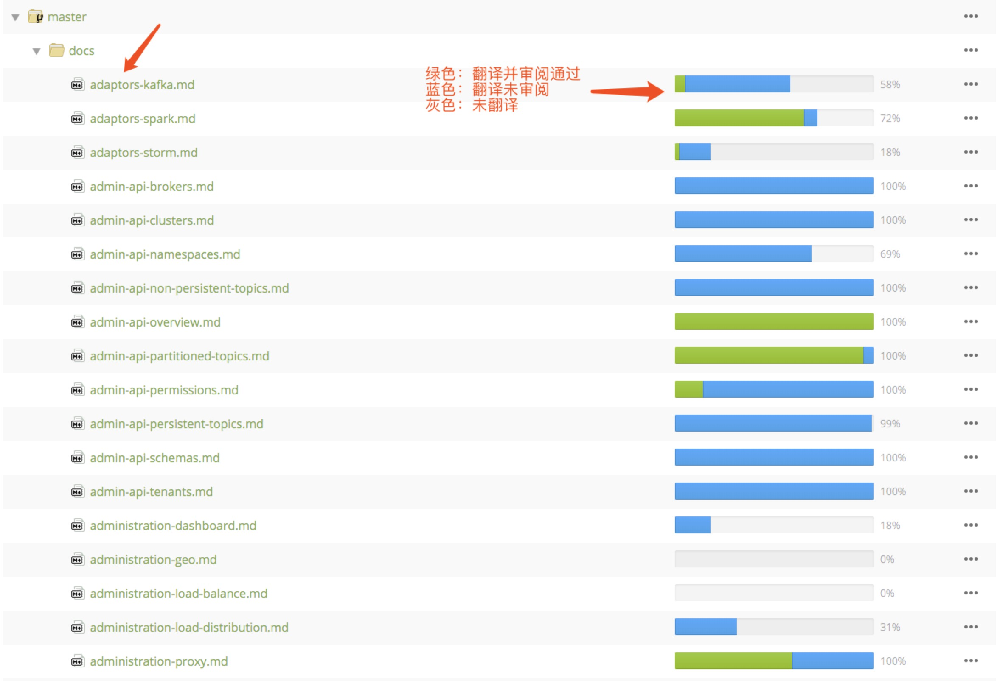
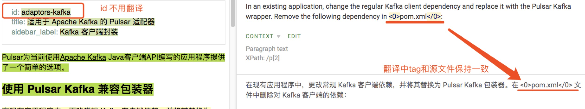
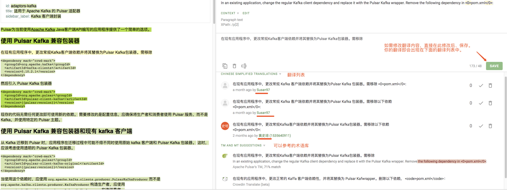
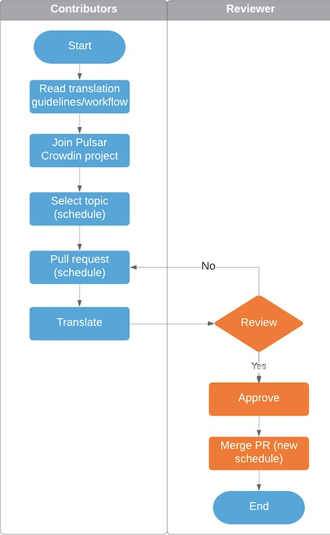
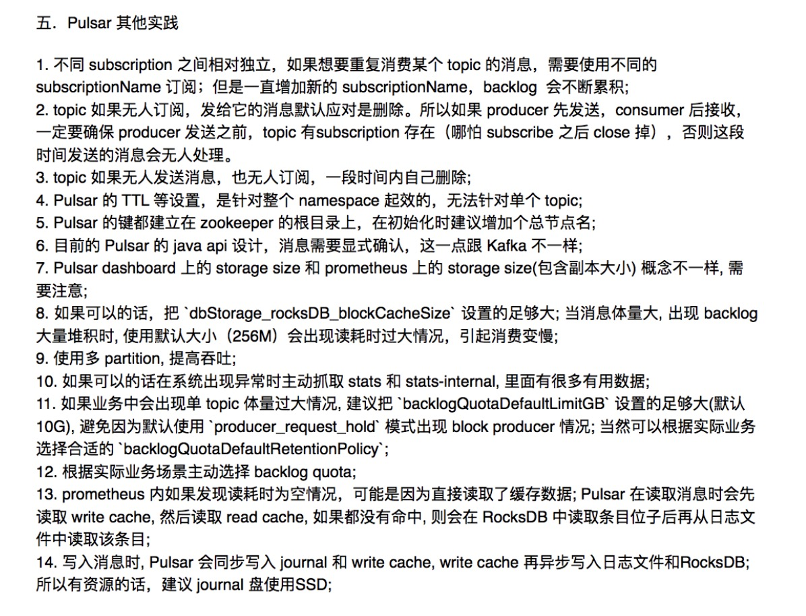

# Translation workflow and guidelines

Welcome to join the Pulsar translation project! Before translating, read translation [workflow](#workflow) and [guidelines](#guidelines).

## Workflow

You can find [Apache Pulsar translation project](https://crowdin.com/project/apache-pulsar) on Crowdin. For further details about the functions of Crowdin, see [Crowdin](https://crowdin.com/).
Here are the steps of the translation workflow:

### Join the Pulsar translation project
1. Sign in [Apache Pulsar Crowdin project](https://crowdin.com/project/apache-pulsar). If you don’t have a Crowdin account, on the crowdin page, click **SIGN UP** at the upper right corner and fill in the information to create an account. If you have a GitHub, Facebook, Google, Twitter, or Gitlab account, you can link any of them to sign in.

2. After signing in, click **Join** at the upper right corner on the crowdin page.
> #### Note  
> The source language of Pulsar files is English. The target languages of our translation projects are Chinese, French and Japanese.  
> Select a language. Take the **Simplified Chinese Translation Project** as an example.

### Choose a file to translate and submit a PR
1. Click **Simplified Chinese Translation Project**. 
2. Click  **master > docs**,  and check out the status of each file. 
Files in **master > docs** are the source files of the latest versions on Pulsar official website. You only need to translate these markdown files.

   
- Green: translated and approved  
- Blue: translated but not approved 
- Grey: not translated

Based on your knowledge about Pulsar, you can translate the content that you are familiar with first.

After choosing the file to translate, please check it out in [Translation schedule](https://github.com/apache/pulsar-translation/blob/master/schedule.md). If you find someone is translating this file, please choose another one. If not, you can create a PR and add the file  name to [Translation schedule](https://github.com/apache/pulsar-translation/blob/master/schedule.md). Then you can submit the PR.

### Label Setting
- Reviewers : No need to set up. Reviewers will receive the notification of PR you submitted automatically and will designate someone to handle it.
- Assignees : Choose yourself to receive notifications.
- Label : Choose “translation”.

### Translating
While translating, you don’t need to translate the ID of the file and keep the tag the same as the source file.
> ####mportant  
> Don’t modify, omit or add a space in a tag, as the omission or relocation of a tag leads to mistakes shown on the website.

You can modify and save the content directly. Your version will appear automatically at the top of the translation list, as Crowdin will record different versions from different translators. **TM AND MT TRANSLATION** in the bottom-right corner offers you TMs in Pulsar, Crowdin, and other websites.

> #### Tip
> You can use and update [Pulsar 文档翻译术语库](https://shimo.im/sheets/5jozGy5WIUQQf5JV/MODOC) while translating.

### Review
After finishing a translation, please leave a comment in your PR.  : 
For example, I've finished the translation, could you help review?

After receiving the comment, reviewers start to review. The reviewer can make simple comments and notify the translator. Direct discussion in PR is encouraged.

If there are no problems, the reviewer will approve this PR and merge it.

The following image gives a general workflow. The workflow source file is available  at [lucidchat](https://www.lucidchart.com/invitations/accept/0ebad9d8-ddf3-4a92-8ee6-e813a9bc58ff).   
Masakazu shares a more detailed [swimlane](https://swimlanes.io/d/8L04SRASw) for the workflow. 

## Guidelines 
Here are some common problems during translation. This guideline provides some advice. Please read and follow this guideline carefully before start translation. This could help improve the quality of Pulsar translation files and unify the translation style.

### 1. Terms

Pulsar, Pulsar Functions, BookKeeper, ZooKeeper: no need to translate (keep the same capitalization)  
broker, bookie, proxy: no need to translate (keep the same capitalization)  
topic, producer, consumer:  translate to “主题”, “生产者”, “消费者”.

More details about Pulsar TB, see [Pulsar 文档翻译术语库](https://shimo.im/sheets/5jozGy5WIUQQf5JV/MODOC). Welcome to add and modify terms in this document.

### 2. Add space between Chinese and English characters and numbers

In order to improve the readability of Chinese and English mixed documents, you should add spaces between Chinese and English characters and numbers.

 
- Apache Pulsar是一个开源的分布式发布-订阅消息系统，由Apache软件基金会管理，并于2018年9月成为Apache顶级开源项目。❌ 

- Apache Pulsar 是一个开源的分布式发布-订阅消息系统，由 Apache 软件基金会管理，并于 2018 年 9 月成为 Apache 顶级开源项目。✅ 

> ####Note
> You don’t need to add spaces behind Chinese punctuations, even if they are followed by English words.

###  3. Chinese punctuation

Please use Chinese punctuations in Chinese documents: You should use “、”  rather than  “，” when you translate English into Chinese. For example, “Kubernetes, Meso, Docker“ should be translated to “Kubernetes、Mesos、Docker“. Vice versa.

Dealing with different items : Please use (。) at the end of one sentence and use (；) at the end of one item. If each item involves one sentence, please use (。) at the end of each item.

 

This example use (。) at the end of each practice.

### 4.Translate “you“ to “你“

To unify the language style, you’d better omit "you". If it is necessary, you can translate it into “你“.  

### 5. Comments in the sample code 

You’d better translate comments in the sample code. If the comment is simple, you can omit it.

### 6. The liberal translation is better than the literal translation

You’d better not translate word by word. After translating, please check out your words and pay attention to the accuracy and brevity. Based on your full understanding of the source text, you can adopt the liberal translation method. Sometimes, you can omit the translation of quantifier, auxiliary, subject and so on to keep the sentence easy to read.

#### 6.1 ...的...的...的...

You can omit ” ’s “ to make the text easy to read. Here are some examples :

- Pulsar’s documentation is located in the docs folder in Pulsar’s source code repository.

If you translate all the “的”, it can’t read smoothly:

- Pulsar 的文档位于 Pulsar 的源码仓库的 docs 文件夹中。 ❌ 

Deleting the unnecessary “的” seems better:

- Pulsar 文档位于 Pulsar 源码仓库的 docs 文件夹中。 ✅ 

#### 6.2 一个……

When you translate English into Chinese, you don’t need to translate all the plural; you don’t need to translate  ”a” or  ”an”. Here are some examples :

- Using a Pulsar client with the proxy

Translate “a” into “一个” :

- 使用有 proxy 的一个 Pulsar 客户端   ❌  

Deleting the redundant ”一个“ makes the text more concise.

- 使用有 proxy 的 Pulsar 客户端   ✅ 

### 7. Use passive tense as little as possible

You don’t need to use “被” in translation. For example :   

 - source : Once the message above is successfully published to the topic, you can see it in the standard output: Hello Pulsar.
 - original : 一旦上面的消息被成功发布到Topic中，您会在标准输出中看到它 : Hello Pulsar”。   ❌
 - adjusted : 上面的消息成功发布到主题后，你会在标准输出中看到 : Hello Pulsar。    ✅ 

### 8. Simple future tense
You don’t need to translate “will” to “将要......”. It is better to use the present tense. For example :  

- This will publish a single message to the Pulsar topic. 
- original : 这将向Pulsar的Topic发送单条消息。   ❌
- adjusted : （......）给 Pulsar 主题发布一条信息。   ✅ 

### 9. Examples
You can adjust your words according to the context when you translate “Here’s sth”. For example: 

- Here's an example.
- original : 这里有一个示例。   ❌
- adjusted : 下面是一个示例。     ✅ 

### 10. Keep your words easy to read
Keep your words simple and smooth. Therefore, please double check your words after finishing translation.

## Add you as a contributor
When your first pull request is merged, feel free to add your name to the [contributor list](https://github.com/apache/pulsar-translation/blob/master/CONTRIBUTORS.md). 

